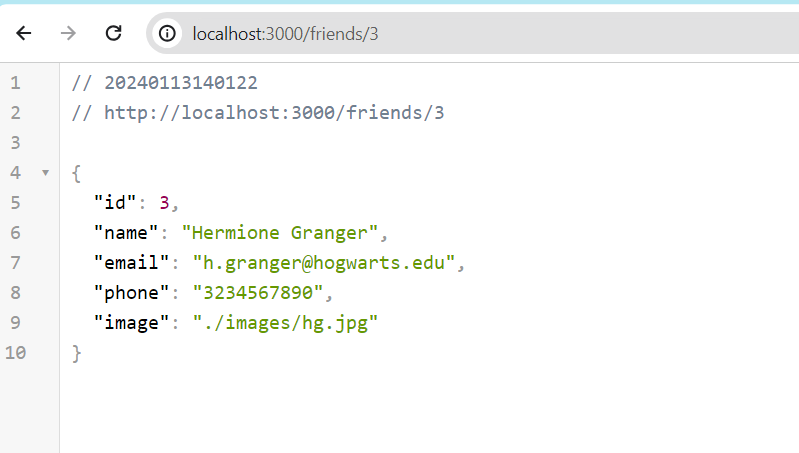

# contact-book-ExpressApp

A simple CRUD web application to manage a contact book using Node.js and Express.

## Update

As of 1/13/2024, for ALAB 318.2.1:

1. Used `friends-data.js` to populate the app. In the future, will try to use MongoDB.
2. `Add Friend` feature is not developed yet. Only the page is rendering using the EJS view engine.
3. Headshot images are not displaying on the homepage. Will solve this later.

## Table of Contents

- [ALAB 318.2.1 Features](#ALAB-318.2.1-Features)
- [Preview](#preview)
- [Features](#features)
- [Project Structure](#project-structure)
- [Installation](#installation)
- [Usage](#usage)
- [Routes](#routes)
- [Dependencies](#dependencies)

## ALAB 318.2.1 Features

1. View templates include:
   - Home page to display a table of all friends' contact info.
   - Add friend page.
   - Gallery page.
2. Router parameter used friend id `/friends/:id` to return a friend's details in JSON.
3. A button to use `res.download` method to download a gallery picture (not working; will investigate later).

### Preview





## Features

- Add, edit, and delete contacts.
- View a gallery of images.

## Project Structure

```plaintext
/project-root
  /routes
    routes.js
  /views
    /layout
        header.ejs
        footer.ejs
    add_friend.ejs
    gallery.ejs
    index.ejs
  /images
    squad.jpg
  /data
    friends-data.js
  main.js
  .env
  .gitignore
  README.md
```

## Installation

Clone the repository:

```bash
git clone <repository-url>
```

Install dependencies:

```bash
npm install
```

## Usage

Start the application:

```bash
npm start
```

Visit http://localhost:3000 in your web browser.

## Routes

1. **Home Page:**

   - URL: [http://localhost:3000/](http://localhost:3000/)
   - Description: Displays a table of all friends' contact information.
   - Template: `index.ejs`

2. **Friend Details by ID:**

   - URL: [http://localhost:3000/friends/:id](http://localhost:3000/friends/:id)
   - Description: Returns a friend's details in JSON format based on the provided friend ID.

3. **Add Friend Page:**

   - URL: [http://localhost:3000/add](http://localhost:3000/add)
   - Description: Renders the "Add Friend" page.
   - Template: `add_friend.ejs`

4. **Gallery Page:**

   - URL: [http://localhost:3000/gallery](http://localhost:3000/gallery)
   - Description: Renders the "Gallery" page.
   - Template: `gallery.ejs`

5. **Download Image:**

   - URL: [http://localhost:3000/download/squad.jpg](http://localhost:3000/download/squad.jpg)
   - Description: Downloads the "squad.jpg" image using `res.download`.
